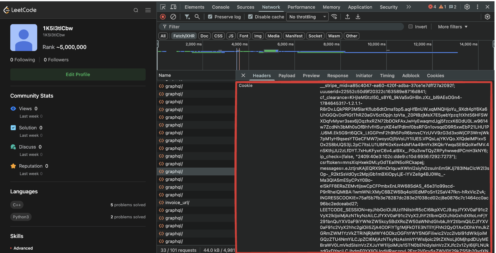
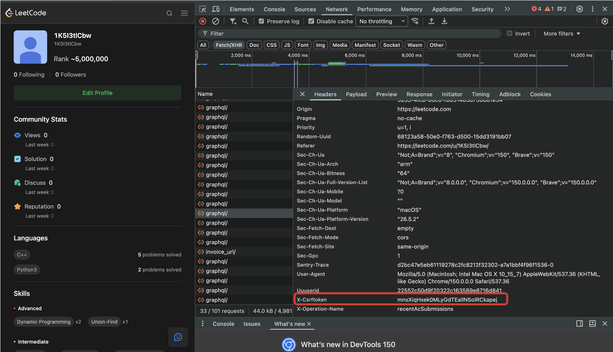
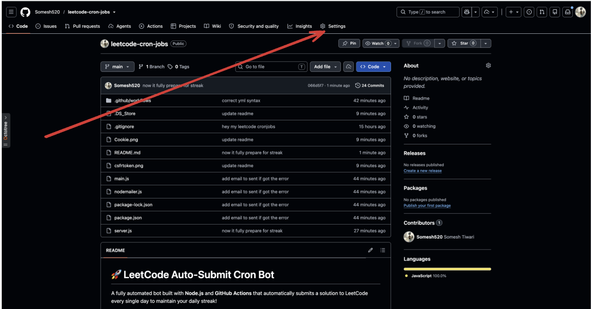
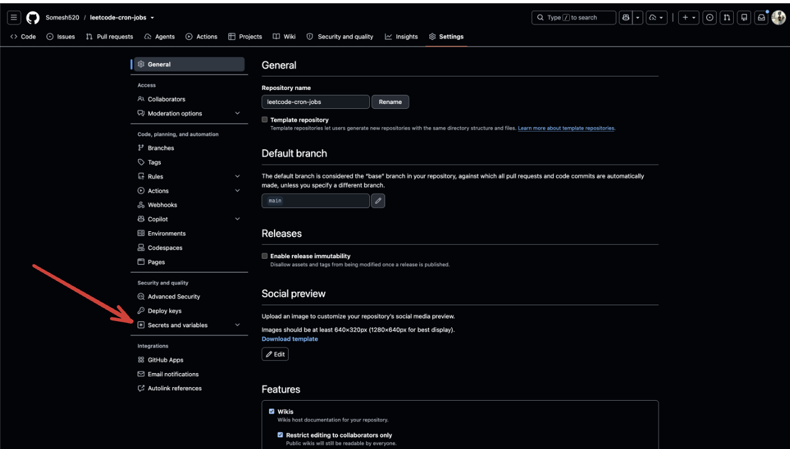
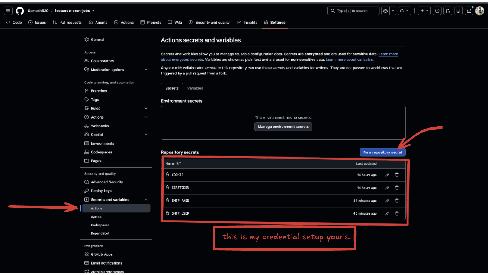

# 🚀 LeetCode Auto-Submit Cron Bot

A fully automated bot built with **Node.js** and **GitHub Actions** that automatically submits a solution to LeetCode every single day to maintain your daily streak! 

## ✨ Features
- **Zero Maintenance:** Runs automatically every night at 10:00 PM IST using GitHub Actions.
- **Smart Duplicate Prevention:** Uses LeetCode's GraphQL API to check your recent submissions. If you've already solved a problem manually today, the bot will gracefully skip the automated submission.
- **Secure:** Uses GitHub Secrets to keep your `COOKIE` and `CSRFTOKEN` completely safe and hidden from the public.
- **Reliable:** Complete error handling and timeout fallbacks to ensure the action doesn't get stuck.

## 🛠️ How It Works
1. A **GitHub Action** triggers the bot (`server.js`) on a set cron schedule.
2. The bot fetches your recent submissions using LeetCode's internal GraphQL API.
3. It checks the timestamps of your recent accepted submissions.
4. If a submission hasn't been made today, it sends a `POST` request to submit a predefined code snippet for a problem.
5. It polls the submission result API until the code gets an `Accepted` status.

## 🚀 Setup Guide

Want to run this yourself? Follow these simple steps:

### 1. Fork this Repository
Click the **Fork** button at the top right of this repository to create your own copy.

### 2. Get Your LeetCode Tokens
1. Open your browser and log into [LeetCode](https://leetcode.com).
2. Open **Developer Tools** (F12 or Right Click -> Inspect).
3. Go to the **Network** tab.
4. Refresh the page and click on any request sent to `leetcode.com` (like `graphql`).
5. Scroll down to **Request Headers**.
6. Copy the entire `cookie` string.
7. Also, look for `x-csrftoken` in the headers and copy its value. 

*(See the screenshot below for reference)*

![How to find Cookie and CSRF Token]

### 3. Setup Email Notifications (Required for alerts)
To get email alerts for successful submissions or failures, you need an App Password:
1. Go to your Google Account -> **Security**.
2. Enable **2-Step Verification**.
3. Create an **App Password** for this bot.

### 4. Add GitHub Secrets
1. Go to your forked repository on GitHub.
2. Navigate to **Settings** -> **Secrets and variables** -> **Actions**.

3. Click **New repository secret**.
4. Add the following four secrets:
   - Name: `CSRFTOKEN` | Value: *(Paste your x-csrftoken here)*
  
   - Name: `COOKIE` | Value: *(Paste your entire cookie string here)* 
   
   - Name: `SMTP_USER` | Value: *(Your Gmail address, e.g., your.email@gmail.com)*
   - Name: `SMTP_PASS` | Value: *(The 16-character App Password you generated in Step 3)*

### 5. Enable GitHub Actions
1. Go to the **Actions** tab in your repository.
2. Click the button to **Enable workflows**.
3. (Optional) You can click on the "LeetCode Cron Bot" workflow and click **Run workflow** to test it manually!

## ⚙️ Technologies Used
- **JavaScript (ES6)**
- **Axios:** For handling HTTP and GraphQL API requests.
- **GitHub Actions:** For automated CI/CD style scheduling.
- **Node.js 22**

---
⭐ *If you find this project helpful, don't forget to give it a star!*
